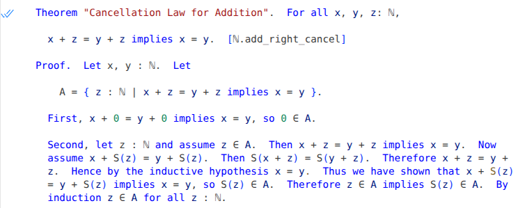

# Natural Lean



Natural Lean is a library that lets you write Lean definitions, theorems, and proofs in a controlled natural language that looks much like ordinary mathematical English.  To use the library, you can simply write `import Natural` at the top of a Lean source file, then write natural-language mathematics freely in the rest of the file.  If you are using an IDE such as Visual Studio Code, Natural Lean will automatically translate your text into native Lean code, which will be checked for correctness.

For a first glimpse of Natural Lean you could look at the file [`examples/nat_num_game.lean`](examples/nat_num_game.lean), which proves all of the theorems from the [Natural Number Game](https://adam.math.hhu.de/#/g/leanprover-community/nng4).  (Actually there are not many  explicit proofs in this file, since Natural Lean's [default tactic](#tactics) can solve most of these problems directly.)  The file [`examples/nat.lean`](examples/nat.lean) is more substantial, and includes a partial development of the natural numbers from first principles in Natural Lean, including a number of theorems with proofs.   (To see the full proofs in this file, you will want to turn on word wrap.  As one possibility, download the file, view it in Visual Studio Code, and press Alt+Z to enable wrapping.)  

Natural Lean is in an __early stage of development__ and is not a practical tool for writing many Lean proofs at this time: the grammar and expressiveness of the language are still extremely limited.  You may nevertheless want to experiment with Natural Lean even in its current state.  Your feedback is welcome: you can send me [email](mailto:adam.dingle@mff.cuni.cz) or open issues in this repository.  I am actively developing the library and hope to evolve the controlled natural language to eventually be robust enough for serious mathematical work.

### Contents

- [Getting started](#getting-started)
- [Definitions](#definitions)
- [Theorems](#theorems)
  - [Theorem groups](#theorem-groups)
- [Proofs](#proofs)
  - [Sequences of proof steps](#sequences-of-proof-steps)
- [Propositions](#propositions)
  - [Operator chains](#operator-chains)
- [Expressions](#expressions)
- [Types](#types)
- [Natural names](#natural-names)
- [Tactics](#tactics)
- [Hints and tips](#hints-and-tips)
     
(Tip: If you are viewing this document on GitHub's web site, you can also click the table of contents icon in the upper right to navigate through the various sections.)

### Getting started
In your project's `lakefile.toml` file, write

```
[[require]]
name = "natural"
git = "https://github.com/medovina/natural_lean.git"
rev = "main"
```

At the top of any Lean source file in your project, write

```
import Natural
```

After that, you can mix natural-language mathematics with native Lean code freely in the same file.


### Definitions

A definition begins with the capitalized word `Definition`.  Three limited kinds of definitions are currently supported.  An _inductive type definition_ defines a new type with one or more constructors:

```
Definition.  The type ℕ is defined inductively with constructors 0 : ℕ and S : ℕ → ℕ.
```

A _definition by cases_ defines a function recursively with one or more cases.  Currently the function must be a supported [arithmetic operator](#expressions):

```
Definition.  The binary operation + on ℕ is defined recursively such that
  for all x, y : ℕ,

  a.  x + 0 = x.
  b.  x + S(y) = S(x + y).
```

A _direct definition_ defines a function non-recursively, using a single formula.  Currently the function must be a supported [relational operator](#propositions):

```
Definition.  For all x, y : ℕ, x < y iff there is some z : ℕ such that x + S(z) = y.
```

### Theorems

A natural-language theorem is introduced by the capitalized keyword `Theorem` (as distinguished from lowercase `theorem`, which begins a theorem in native Lean syntax).  Every theorem must have a __name__, which may appear either immediately after the word `Theorem`, or in brackets after the theorem statement.  Thus, these two declarations are equivalent:

```
Theorem ℕ.succ_ne_self.  For all x : ℕ, S(x) ≠ x.

Theorem.  For all x : ℕ, S(x) ≠ x.  [ℕ.succ_ne_self]
```

I generally find the second style above to be more readable.

A theorem's name must be a valid Lean identifier and is its actual name in Lean.  Additionally a theorem may optionally have a __long name__, which may be any string and appears in quotes:

```
Theorem "Associativity of Addition".  For all x, y, z: ℕ,

  x + (y + z) = (x + y) + z.  [ℕ.add_assoc]
```

(At the moment a long theorem name is just documentation; it's not possible to refer to it as a reason in a proof step.)

A theorem name in brackets may optionally be followed by a Lean attribute to attach to the theorem:

```
Theorem.  For all x : ℕ, 0 + x = x.  [ℕ.zero_add: @simp]
```

A theorem may or may not be followed by a __proof__.  If a proof is not present, Natural Lean will attempt to prove the theorem using the [default tactic](#tactics).  If a proof is present, it appears after the text `Proof.`:

```
Theorem.  For all x : ℕ, x < S(x).  [ℕ.lt_succ]

Proof.  Let x : ℕ.  x + S(0) = S(x).  Therefore x < S(x).
```

The section [Proofs](#proofs) below describes the structure of proofs.

A theorem may optionally being with a `Let` declaration introducing one or more quantified variables, so the preceding theorem may alternatively be written as

```
Theorem.  Let x : ℕ.  x < S(x).  [ℕ.lt_succ]

Proof.  x + S(0) = S(x).  Therefore x < S(x).
```

A `Let` declaration of this nature is automatically included at the beginning of a proof, unless the proof already begins with a `Let` declaration.
#### Theorem groups

Several theorems may appear together in a single __theorem group__:

```
Theorem.  Let x, y, z : ℕ.

  a. x ≤ x.  [ℕ.le_refl]
  b. If x < y and y ≤ z then x < z.  [ℕ.lt_of_lt_of_le]
  c. If x ≤ y and y < z then x < z.  [ℕ.lt_of_le_of_le]

Proof.

  b. Suppose that x < y ≤ z.  We know that y = z or y < z.  If y = z, then x < z.
    If y < z, then x < z by ℕ.lt_trans.

  c. Suppose that x ≤ y and y < z.  We know that x = y or x < y.  If x = y,
    then y < z.  If x < y, then x < z by ℕ.lt_trans.
```

In a theorem group, each theorem must have a __label__, such as "a", "b" or "c" above.  The theorem group may have an associated `Proof` section containing labelled proofs for the theorems in the group.  As in the example above, some theorems in the group might not have proofs.

As visible above, a theorem group may begin with a `Let` declaration that is shared by all theorems in the group.   Any free variables in each theorem's statement will automatically be universally quantified using the type in the `Let` declaration.  Thus, the theorem group above is equivalent to

```
Theorem.

  a. For all x : ℕ, x ≤ x.  [ℕ.le_refl]
  b. For all x, y, z : ℕ, if x < y and y ≤ z then x < z.  [ℕ.lt_of_lt_of_le]
  c. For all x, y, z : ℕ, if x ≤ y and y < z then x < z.  [ℕ.lt_of_le_of_le]

Proof.
  ...
```

A `Let` declaration at the top of a theorem group will automatically be included at the beginning of each proof in the group, unless that proof already begins with its own `Let` declaration. 

### Proofs

A __proof__ consists either of the keyword `By` followed by a __reason__, or a series of __proof steps__.

A reason may be any of the following:

- One or more theorem names, separated by `and`, e.g.

  `By ℕ.add_assoc and ℕ.succ_ne_self.`

- The keyword `induction`.
- An arbitrary Lean tactic in brackets, e.g.

  `By [simp +arith]`.

A proof step may be any of the following:

- An __assertion__ states a fact.  It may be preceded by a word such as `So`, `Now`, `Hence` or `Clearly`, and may optionally include a reason introduced by the `by` keyword.  Examples:

    ```
    Clearly 0 ∈ B.
    Hence by induction y ∈ B for all y: ℕ.
    Then x < z by ℕ.lt.
    ```
  (In addition to the reasons listed above, an assertion in a proof by induction may use the reason `by the inductive hypothesis`.)

- A __let declaration__ introduces one or more universally quantified variables of a given type.  Examples:

    ```
    Let x, y, z : ℕ.
    Let a : ℤ.
    ```

- A __let definition__ introduces a variable and gives it a value.  Examples:

    ```
    Let x = 0.
    Let A = { z : ℕ | x + (y + z) = (x + y) + z }.
    ```

- An __assumption__ is expressed using the keyword `assume` or `suppose`.  Example:

    ```
    Assume that v ∈ A.
    Suppose that z = 0 .
    ```
  
  If an assumption does not appear at the beginning of an if/otherwise block, then Natural Lean will infer its scope heuristically.

In addition, the following are __compound steps__ that group proof steps together:

- An __if/then__ block introduces an assumption whose scope is limited to a single sentence.  Example:

   ```
   If z = 0 then x = y, so x ≤ y.
   ```

   This is like

   ```
   Assume that z = 0.  Then x = y.  So x ≤ y.
   ```

   except that the first form above restricts the assumption `z = 0` to be active only through the assertion `x ≤ y`.

- An __if/otherwise__ block allows a proof to consider two mutually exclusive possibilities.  It may have either of these forms:

    ```
    Assume A. (<proof_step>)+  Otherwise (<proof_step>)+  In either case B.

    If A then (<assertion>)+.  Otherwise (<proof_step>)+  In either case B.
    ```

  Here is an if/otherwise block expressed using each of the forms above, which are equivalent:

    ```
    Assume that x < y.  Then there is some w : ℕ such that x + S(w) = y. 
      Otherwise x = y, so x + 0 = y.  In either case there is some z : ℕ such that
      x + z = y.

    If x < y then there is some w : ℕ such that x + S(w) = y.  Otherwise x = y,
      so x + 0 = y.  In either case there is some z : ℕ such that x + z = y.
    ```

- A __cases__ block allows a proof to consider several mutually exclusive possibilities:

  ```
  Case 1: v < y.  Then v + S(z) = y for some z : ℕ.  By ℕ.is_zero_or_succ either
    z = 0, or z = S(u) for some u : ℕ.  So S(v) < y or S(v) = y.

  Case 2: v = y.  Then S(v) = S(y) = y + S(0).  So y < S(v).

  Case 3: y < v.  Then v = y + S(u) for some u : ℕ.  Hence

      S(v) = S(y + S(u)) = y + S(S(u)).

    Thus y < S(v).

  In all cases S(v) < y or S(v) = y or y < S(v). 
  ```

#### Sequences of proof steps

In theory, you may write each proof step as a single sentence, with no extra words between steps:

```
Let z : ℕ.  Assume z ∈ A.  x + z = y + z implies x = y.
Assume x + S(z) = y + S(z).  S(x + z) = S(y + z).  x + z = y + z.
By the inductive hypothesis x = y.  x + S(z) = y + S(z) implies x = y.
S(z) ∈ A.
```

However this style feels wooden and unnatural, and is discouraged in Natural Lean.  Instead, you may place  filler words such as "so", "then", "therefore", "hence", "thus" and so on between steps.  Furthermore, you may group multiple steps into a single sentence, separated by the words "and" or "so".  For example, the proof steps above might be rewritten like this:

```
Let z : ℕ and assume z ∈ A.  Then x + z = y + z implies x = y.
Now assume x + S(z) = y + S(z).  Then S(x + z) = S(y + z).
Therefore x + z = y + z.  Hence by the inductive hypothesis x = y.
Thus we have shown that x + S(z) = y + S(z) implies x = y,
so S(z) ∈ A.
```

This sounds more like textbook mathematics, and illustrates the writing style for which Natural Lean is intended. 

### Propositions

Each theorem asserts that a certain __proposition__ is true, and every assertion step in a proof also contains a proposition.  A proposition may have any of these forms:

```
<expr> <rel_op> <expr>
<prop> (,)? and <prop>
(either)? <prop> (,)? or <prop>
<prop> implies <prop>
<prop> iff <prop>
if <prop> then <prop>
for all (<var>),+ : <type> , <prop>
<prop> for all (<var>),+ : <type>
there exists (some | no) (<var>),+ : <type> such that <prop>
<prop> for some (<var>),+ : <type>
(at least | at most | exactly) one of (<prop>),+ is true
(this is | we have) a contradiction
```

Above `<prop>` is a proposition and `<rel_op>` indicates a relational operator such as `=`, `≠` or `<`.   `<expr>` and `<type>` are expressions or types as described in the sections that follow.

Here are some examples of propositions:

```
x = 0
x + S(y) = S(x + y)
x < y and y < z implies x < z
for all x : ℕ, S(x) ≠ x
z ∈ A for all z: ℕ
there exists some y : ℕ such that x = S(y)
y = S(u) for some u : ℕ
at least one of x < y, x = y, y < x is true
```

Natural Lean follows the usual precedence for Boolean operators:  `and` normally has the highest precedence, followed in turn by `or`, `implies` and `iff`.  For example, `x > 0 and y > 0 or z > 0` means `(x > 0 and y > 0) or z > 0`.  However, a comma before `and` or `or`will cause the operator to have a low precedence.  For example, `x > 0, and y > 0 or z > 0` means `x > 0 and (y > 0 or z > 0)`.
#### Operator chains

A proposition may contain __chained relational operators__: for example, `x < y ≤ z = w` has the same meaning as `x < y and y ≤ z and z = w`.  In an assertion, each step in a chain may optionally have a reason:

```
z = (x + S(u)) + S(v)
  = x + (S(u) + S(v)) by ℕ.add_assoc
  = x + S(u + S(v)) by ℕ.succ_add.
```

### Expressions

__Expressions__ represent mathematical values.  In Natural Lean an expression has any of the following forms:

```
<num>
<var>
<expr> <expr>      -- implicit multiplication
<expr> <op> <expr>
<expr> ( <expr> )  -- function call or multiplication
( <expr> )
{ <var> : <type> | <prop> }
```

Above, `<num>` is a natural number constant and `<op>` is an arithmetic operator.  At the moment Natural Lean includes only a small fixed set of these operators: the `+`,  `·` and `^` operators, plus `×` which is a synonym for `·`. (I hope to extend the system before long so that all operators predefined in a Lean theory will also be available in Natural Lean.)

Here are some examples of expressions:

```
0
y
x + (y + z)
S(x + y)
a(b + c)
ac + bc
{ z : ℕ | x + (y + z) = (x + y) + z }
```

Implicit multiplication is supported: `xy` with no parentheses means `x · y`.  Note that Natural Lean uses the traditional function call syntax `f(x)`, which is different from `f x` as found in native Lean code.  An expression of the form `a(b)` is potentially ambiguous: it may represent either a multiplication or a function call.  Natural Lean resolves this ambiguity based on the type of `a`: if it is a function, then `a(b)` is considered to be a function call, otherwise a multiplication.

Any Lean keyword such as `def` cannot be used as an implicit product in Natural Lean.  So if you want to compute the product of variables `d`, `e`, and `f`, you can write e.g. `d · e · f` or `(de)f`, but not `def`.  Note that `at` is also a Lean keyword, so you must write `a · t` for the product of `a` and `t`.  (I hope to remove this limitation at some future point.)


Unicode superscript digits and letters are supported, so you may write e.g. `x²` in place of `x^2`, or `xʸ` in place of `x^y`.  A superscripted expression may include the  `+` operator, so `xⁱ⁺ʲ` is the same as `x ^ (i + j)`.

### Types

At the moment any type in Natural Lean must be either a simple type such as `Nat`, or a function type such as `Nat → Nat → Nat`.
I plan to add other types such as product types soon.

### Natural names

In Natural Lean, any simple type such as `Nat` or `Int` may have a __natural name__ such as "natural number" or "integer".  You may refer to a type either by its Lean name or its natural name.  For example, the following statements are equivalent:

```
For all x : Nat, x < x + 1.

For all natural numbers x, x < x + 1.
```

You can use an attribute to assign a natural name to a type that already exists in Lean:

```
attribute [natural_name "natural number"] Nat
attribute [natural_name "integer"] Int
```

In fact the preceding two attributes are predefined in Natural Lean, so you don't need to write them.

A natural name must consist of only one or two words, each of which must be at least two letters long (to help distinguish them from variable names).

When you define a new type in Natural Lean, you may give it a natural name as well as a Lean name:

```
Definition.  The type ℕ (the natural numbers) is defined inductively
  with constructors 0 : ℕ and S : ℕ → ℕ.
```


This particular definition redefines the name "natural number" so that it refers to the inductive type that it is defining, rather than Lean's built-in `Nat` type.

### Tactics

When an assertion does not contain a reason, or when a theorem does not include a proof at all, Natural Lean will attempt to prove the assertion or theorem using a tactic named `default` which tries each of `trivial`, `grind` and `aesop` in turn.  In the future I intend to make the default tactic configurable by any development in Natural Lean, but for the moment it is fixed.

As described above, an assertion or theorem may have a reason indicating one or more named theorems:

```
But x + S(z) ≠ x by ℕ.not_succ_add and ℕ.add_comm.
```

In this situation Natural Lean will invoke the tactic `default_apply` with the given theorem names, e.g. using the Lean code `(by default_apply ℕ.not_succ_add ℕ.add_comm)`.  `default_apply` is a tactic that calls each of `apply_rules`, `grind` and `aesop` in turn, passing the given theorems as arguments.  (I also intend to make this tactic configurable in the future.)

### Hints and tips

You may notice that Visual Studio Code doesn't display a double checkmark beside natural-language theorems that have been proven.  That's due to a [bug](https://github.com/leanprover/lean4/issues/15044) in Lean.  I have submitted a [pull request](https://github.com/leanprover/lean4/pull/15045) that will fix it, so hopefully that will land soon.

The `try?` tactic is very useful.  If a proof step fails, try adding `by [try?]`to that step.  If that succeeds, the information in the InfoView will often reveal which theorem(s) you will need to use to prove the step without `try?`.  For example, if the InfoView shows

  ```
  Try these:
    [apply] grind only [Nat.eq_one_of_mul_eq_one_left]
    [apply] grind => instantiate only [Nat.eq_one_of_mul_eq_one_left]
  ```

then you should be able to prove the step by writing `by Nat.eq_one_of_mul_eq_one_left`, since Natural Lean's `default_apply` tactic will call `grind`. 

Natural Lean is currently quite lax about plurals, articles, and capitalization, so at the moment you may be able to get away with writing ungrammatical English such as "Let a and b be natural number".  I plan to check grammar more strictly in the future.

If you would like to see the Lean code that is generated from any definition or theorem in Natural Lean, write `set_option trace.Elab.command true in` immediately before the definition or theorem.  The Lean code will be visible in the InfoView window in Visual Studio Code.
